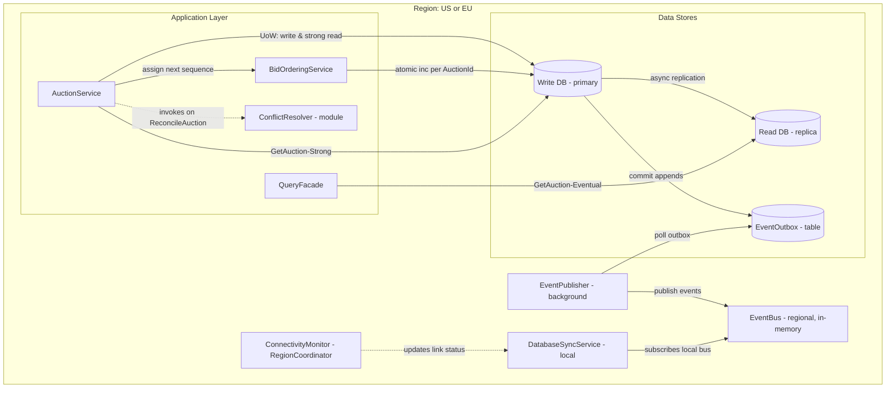
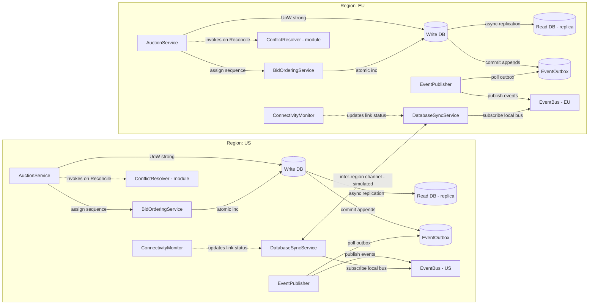

# Architecture Diagrams

## Single-Region (v0)

```mermaid
graph LR
  subgraph Region[Region: US or EU]
    direction LR

    subgraph App[Application Layer]
      AS[AuctionService]
      BOS[BidOrderingService]
      CRS[ConflictResolver - module]
      QRY[QueryFacade]
    end

    subgraph Data[Data Stores]
      WDB[(Write DB - primary)]
      RDB[(Read DB - replica)]
      OBOX[(EventOutbox - table)]
    end

    PUB[EventPublisher - background]
    EB[EventBus - regional, in-memory]
    DBS[DatabaseSyncService - local]
    RCM[ConnectivityMonitor - RegionCoordinator]

    %% Write path (strong)
    AS -->|UoW: write & strong read| WDB
    AS -->|assign next sequence| BOS
    BOS -->|atomic inc per AuctionId| WDB

    %% Replication to read model (eventual)
    WDB -->|async replication| RDB

    %% Outbox → Bus
    WDB -->|commit appends| OBOX
    PUB -->|poll outbox| OBOX
    PUB -->|publish events| EB

    %% Cross-region sync (simulated)
    DBS -->|subscribes local bus| EB

    %% Reads
    AS -->|GetAuction-Strong| WDB
    QRY -->|GetAuction-Eventual| RDB

    %% Partition coordination
    RCM -.->|updates link status| DBS

    %% Reconciliation call
    AS -.->|invokes on ReconcileAuction| CRS
  end
```
## Multi-Region (v0)

```mermaid
graph LR

  subgraph US[Region: US]
    direction LR
    US_AS[AuctionService]
    US_BOS[BidOrderingService]
    US_CRS[ConflictResolver - module]
    US_WDB[(Write DB)]
    US_RDB[(Read DB - replica)]
    US_OBOX[(EventOutbox)]
    US_PUB[EventPublisher]
    US_EB[EventBus - US]
    US_DBS[DatabaseSyncService]
    US_RCM[ConnectivityMonitor]
    US_AS -->|UoW strong| US_WDB
    US_AS -->|assign sequence| US_BOS
    US_BOS -->|atomic inc| US_WDB
    US_WDB -->|async replication| US_RDB
    US_WDB -->|commit appends| US_OBOX
    US_PUB -->|poll outbox| US_OBOX
    US_PUB -->|publish events| US_EB
    US_DBS -->|subscribe local bus| US_EB
    US_AS -.->|invokes on Reconcile| US_CRS
    US_RCM -.->|updates link status| US_DBS
  end

  subgraph EU[Region: EU]
    direction LR
    EU_AS[AuctionService]
    EU_BOS[BidOrderingService]
    EU_CRS[ConflictResolver - module]
    EU_WDB[(Write DB)]
    EU_RDB[(Read DB - replica)]
    EU_OBOX[(EventOutbox)]
    EU_PUB[EventPublisher]
    EU_EB[EventBus - EU]
    EU_DBS[DatabaseSyncService]
    EU_RCM[ConnectivityMonitor]
    EU_AS -->|UoW strong| EU_WDB
    EU_AS -->|assign sequence| EU_BOS
    EU_BOS -->|atomic inc| EU_WDB
    EU_WDB -->|async replication| EU_RDB
    EU_WDB -->|commit appends| EU_OBOX
    EU_PUB -->|poll outbox| EU_OBOX
    EU_PUB -->|publish events| EU_EB
    EU_DBS -->|subscribe local bus| EU_EB
    EU_AS -.->|invokes on Reconcile| EU_CRS
    EU_RCM -.->|updates link status| EU_DBS
  end

  %% Simulated inter-region link for sync
  US_DBS <-->|inter-region channel - simulated| EU_DBS

```
