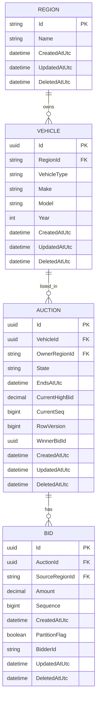
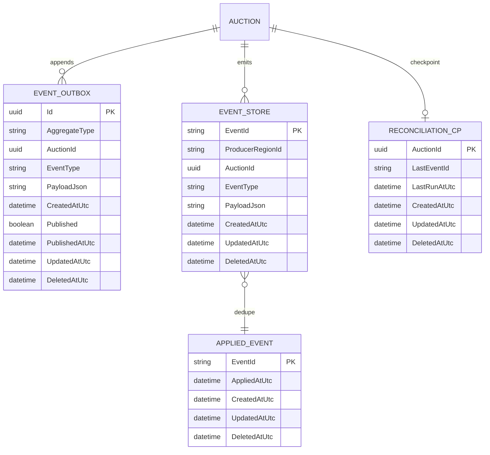

# ERD — Core Domain & Eventing

## Core Domain (Region, Vehicle, Auction, Bid)

```mermaid
erDiagram
  REGION ||--o{ VEHICLE : owns
  VEHICLE ||--o{ AUCTION : listed_in
  AUCTION ||--o{ BID : has

  REGION {
    string   Id PK
    string   Name
    datetime CreatedAtUtc
    datetime UpdatedAtUtc
    datetime DeletedAtUtc
  }

  VEHICLE {
    uuid     Id PK
    string   RegionId FK
    string   VehicleType
    string   Make
    string   Model
    int      Year
    datetime CreatedAtUtc
    datetime UpdatedAtUtc
    datetime DeletedAtUtc
  }

  AUCTION {
    uuid     Id PK
    uuid     VehicleId FK
    string   OwnerRegionId FK
    string   State
    datetime EndsAtUtc
    decimal  CurrentHighBid
    bigint   CurrentSeq
    bigint   RowVersion
    uuid     WinnerBidId
    datetime CreatedAtUtc
    datetime UpdatedAtUtc
    datetime DeletedAtUtc
  }

  BID {
    uuid     Id PK
    uuid     AuctionId FK
    string   SourceRegionId FK
    decimal  Amount
    bigint   Sequence
    datetime CreatedAtUtc
    boolean  PartitionFlag
    string   BidderId
    datetime UpdatedAtUtc
    datetime DeletedAtUtc
  }
```
## Eventing (Outbox, EventStore, AppliedEvent, ReconciliationCP)

```mermaid
erDiagram
  AUCTION ||--o{ EVENT_OUTBOX : appends
  AUCTION ||--o{ EVENT_STORE  : emits
  EVENT_STORE }o--|| APPLIED_EVENT : dedupe
  AUCTION ||--o| RECONCILIATION_CP : checkpoint

  EVENT_OUTBOX {
    uuid     Id PK
    string   AggregateType
    uuid     AuctionId
    string   EventType
    string   PayloadJson
    datetime CreatedAtUtc
    boolean  Published
    datetime PublishedAtUtc
    datetime UpdatedAtUtc
    datetime DeletedAtUtc
  }

  EVENT_STORE {
    string   EventId PK
    string   ProducerRegionId
    uuid     AuctionId
    string   EventType
    string   PayloadJson
    datetime CreatedAtUtc
    datetime UpdatedAtUtc
    datetime DeletedAtUtc
  }

  APPLIED_EVENT {
    string   EventId PK
    datetime AppliedAtUtc
    datetime CreatedAtUtc
    datetime UpdatedAtUtc
    datetime DeletedAtUtc
  }

  RECONCILIATION_CP {
    uuid     AuctionId PK
    string   LastEventId
    datetime LastRunAtUtc
    datetime CreatedAtUtc
    datetime UpdatedAtUtc
    datetime DeletedAtUtc
  }
```
